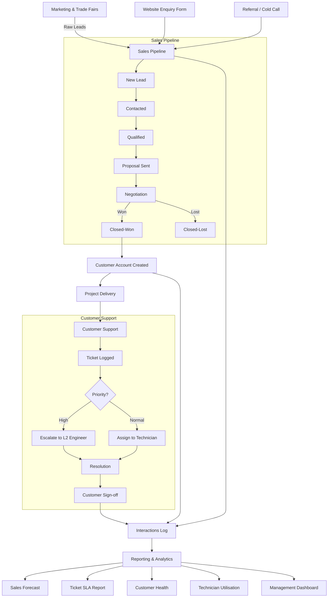
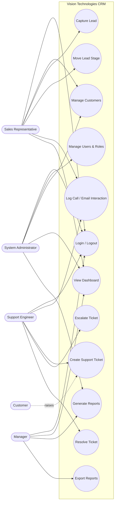
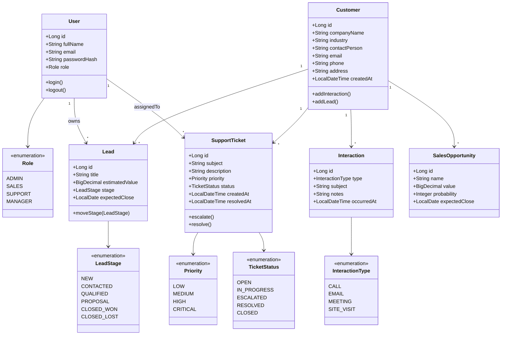
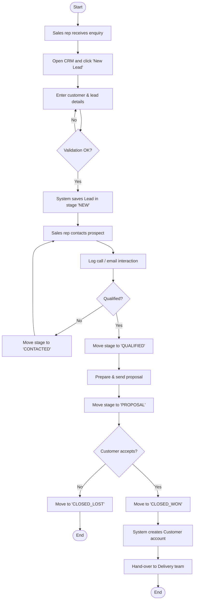
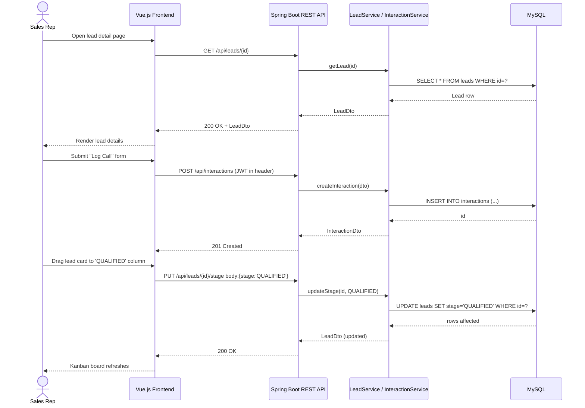
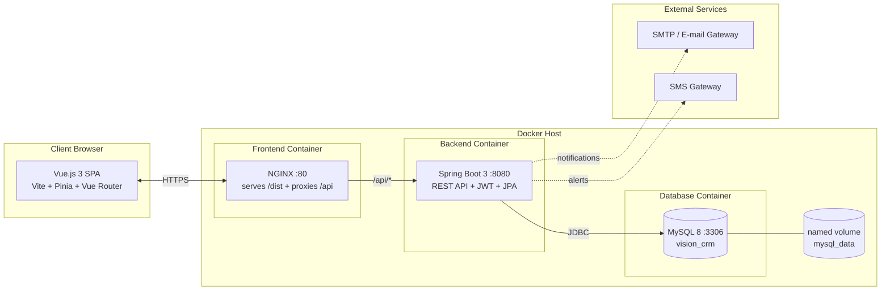

# PHASE 1 — System Analysis & Design

**Project:** Customer Relationship Management (CRM) System
**Case Study:** Vision Technologies Company Ltd (VTC)
**Course:** SENG 8240 — Best Programming Practices and Design Patterns
**Instructor:** Rutarindwa Jean Pierre

---

## 1. Case Study Analysis — Vision Technologies Company Ltd (VTC)

Vision Technologies Company Ltd (VTC) is an East-African technology and infrastructure
integrator that delivers turnkey **Security Systems, IT & Telecommunications, ICT and
Low-Voltage Systems** to corporate, government and mission-critical clients. The company
also provides end-to-end **data-centre design, build and support** services, covering
structured cabling, CCTV and access-control, fire-detection systems, networking, server
rooms, and managed support contracts. Its customer base is highly heterogeneous — banks,
telecom operators, ministries, hospitals, hotels and SMEs — and engagements run from
short break-fix jobs to multi-year managed-service contracts.

Today, VTC's customer-facing operations are managed through scattered tools: e-mail
threads, Excel sheets, WhatsApp groups, paper visit-reports, and a few isolated
spreadsheets per sales executive. As the company grows across Rwanda, Kenya, Uganda and
Burundi, this approach has begun to break down. Sales leads from trade fairs and the
website are lost between people; nobody can say with certainty how many open
opportunities exist, what their pipeline value is, or which engineer last visited which
client. Support tickets raised by phone are sometimes never logged, SLAs are missed, and
managers have no consolidated view of revenue forecasts, customer health, or technician
utilisation. Audit and ISO-compliance reviews are painful because activity history is
not centralised.

A purpose-built **CRM** is therefore required to (a) consolidate all customers, contacts
and contracts in a single source of truth, (b) track the full sales pipeline from raw
lead to closed deal, (c) capture every customer interaction (calls, e-mails, visits),
(d) manage support tickets with priority and SLA tracking, and (e) produce real-time
dashboards and reports for management. The proposed system — built with **Vue.js 3**,
**Spring Boot 3**, **MySQL 8** and **Docker** — will give VTC the operational visibility
and customer intimacy it needs to scale profitably across East Africa.

*Word count: ~300.*

---

## 2. Functional Diagram — VTC Internal Workflow

---

## 3. Problem Statement — Five Pain Points

Without a CRM, Vision Technologies currently faces the following problems:

1. **Fragmented Customer Data.** Customer information is scattered across e-mail,
   spreadsheets, paper site-survey forms and individual sales reps' phones. There is
   no single, reliable source of truth for who the customer is, what they bought, and
   who owns the relationship.

2. **Lost Sales Leads & No Pipeline Visibility.** Leads from trade-fairs, the website
   and referrals are not consistently captured. Management cannot answer basic
   questions such as "how many qualified opportunities are open?" or "what is the
   expected revenue this quarter?", so forecasting is guesswork.

3. **Unstructured Support Workflow & SLA Breaches.** Support requests arrive by phone,
   WhatsApp and e-mail and are not logged in one place. Tickets are forgotten, priority
   is not enforced, and SLA breaches on mission-critical contracts (data centres, banks)
   damage VTC's reputation.

4. **No Interaction History per Customer.** When an engineer visits or a sales rep
   calls, the activity is rarely recorded against the customer record. New staff have
   no context; account managers repeat questions; cross-sell and up-sell opportunities
   are missed.

5. **Manual, Late and Inconsistent Reporting.** Monthly sales, ticket and revenue
   reports are stitched together by hand from many Excel files. Reports arrive late,
   numbers do not reconcile across departments, and ISO / audit reviews are painful
   because activity history cannot be reconstructed.

---

## 4. Object-Oriented Analysis & Design Diagrams

### 4.1 Use Case Diagram

### 4.2 Class Diagram

### 4.3 Activity Diagram — Lead Capture to Customer Conversion

### 4.4 Sequence Diagram — Sales Rep Logs a Call & Updates Lead Stage

### 4.5 Component Diagram

---

*End of Phase 1 documentation.*
